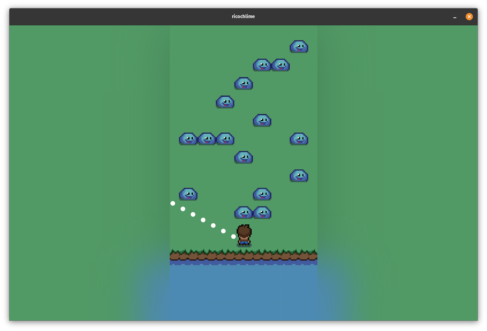

#  Ricochlime

Ricochlime is a game where you attack the advancing monsters with your ricocheting projectiles. The game is made with the [Flame](https://flame-engine.org/) game engine and [Flutter](https://flutter.dev/).

[][google_play]
&nbsp;
[][amazon_appstore]
&nbsp;
[][app_store]
&nbsp;
[][web_app]
&nbsp;
[][download_windows]
&nbsp;
[][flathub]
&nbsp;
[][download_appimage]

[google_play]: https://play.google.com/store/apps/details?id=com.adilhanney.ricochlime
[amazon_appstore]: https://www.amazon.co.uk/Adil-Hanney-Ricochlime/dp/B0CFK76XNX/
[app_store]: https://apps.apple.com/app/ricochlime/id6459539993
[web_app]: https://ricochlime.adil.hanney.org
[flathub]: https://flathub.org/apps/com.adilhanney.ricochlime
[download_windows]: https://github.com/adil192/ricochlime/releases/download/v1.2.0/RicochlimeInstaller_v1.2.0.exe
[download_appimage]: https://github.com/adil192/ricochlime/releases/download/v1.2.0/Ricochlime-1.2.0-x86_64.AppImage
