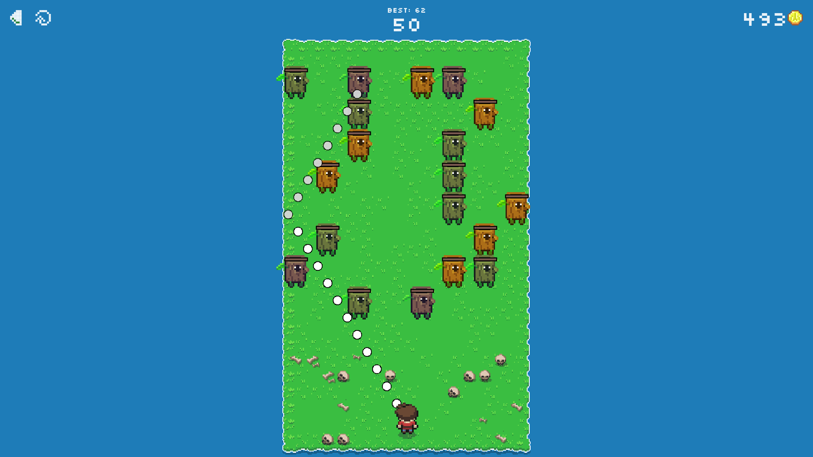

#  Ricochlime

Ricochlime is a casual game for every platform where you defend yourself against waves of monsters with your ricocheting projectiles.

I originally built this game as something to do with my hands while I focused on lectures during my computer science degree. It's designed as a calm, relaxed alternative to the fast-paced, high-stimulation games that dominate the app stores.

You can play it online:

Web:
&nbsp;
[][web_app]

Or download it for your device:

Android:
&nbsp;
[][google_play]
&nbsp;
[][f_droid]
&nbsp;
[][amazon_appstore]

iOS/macOS:
&nbsp;
[][app_store]
&nbsp;
Windows:
&nbsp;
[][download_windows]
&nbsp;
Linux:
&nbsp;
[][flathub]
&nbsp;
[][download_appimage]



[google_play]: https://play.google.com/store/apps/details?id=com.adilhanney.ricochlime
[f_droid]: https://f-droid.org/packages/com.adilhanney.ricochlime/
[amazon_appstore]: https://www.amazon.co.uk/Adil-Hanney-Ricochlime/dp/B0CFK76XNX/
[app_store]: https://apps.apple.com/app/ricochlime/id6459539993
[web_app]: https://ricochlime.adil.hanney.org
[flathub]: https://flathub.org/apps/com.adilhanney.ricochlime
[download_windows]: https://github.com/adil192/ricochlime/releases/download/v1.11.10/RicochlimeInstaller_v1.11.10.exe
[download_appimage]: https://github.com/adil192/ricochlime/releases/download/v1.11.10/Ricochlime-1.11.10-x86_64.AppImage

## Technical

The game is made with the [Flame](https://flame-engine.org/) game engine and [Flutter](https://flutter.dev/), allowing it to be deployed to a wide variety of platforms from a single codebase.

### Why Flutter and Flame?

I chose Flame because of its integration with Flutter.
It is much easier to produce a good user interface in Flutter than with game engines like Unity.

Additionally, Flame is lightweight and performant, making it the best fit for a simple 2D game like this. Ricochlime launches in less than a second and easily runs at 60fps+ on low-end devices while sipping very little battery.

### Project structure
```
RICOCHLIME
├── assets           Game assets
│   ├── audio            Background music files
│   ├── google_fonts     Fonts
│   ├── icon             Icon variants for different platforms
│   └── images           Spritesheets for the character, monsters, etc.
│
├── lib              Main source code
│   ├── ads              In-app purchase handling (ads were removed v1.11.6)
│   ├── flame            Game engine specific code
│   ├── i18n             Translations
│   ├── nes              Retro themed components, extending from the nes package
│   ├── pages            App pages (home, settings, etc.)
│   └── utils            Misc code
│
├── patches          Patches to remove development/proprietary code before publishing
├── scripts          Development scripts (e.g. for generating icons or updating versions)
└── test             Unit and widget tests
```

### Build

To build this project yourself, see [BUILD.md](BUILD.md).
